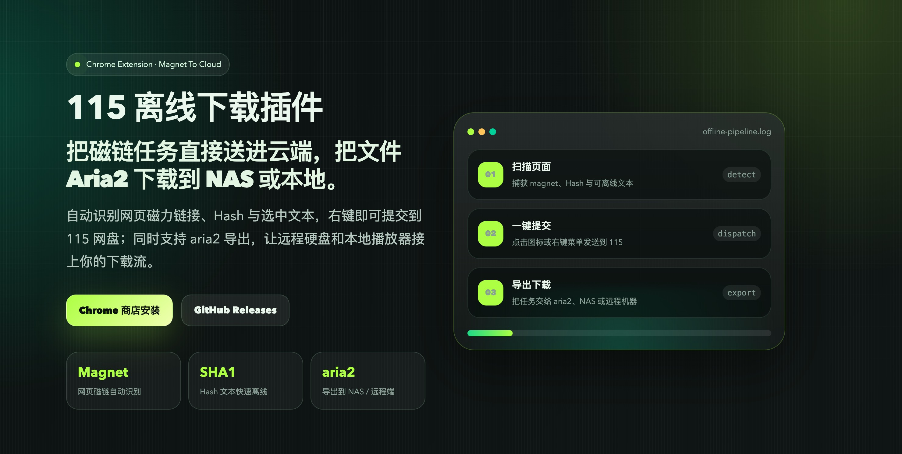

# 115 离线下载插件

把磁链任务直接送进云端，把文件 Aria2 下载到 NAS 或本地。

这是一个面向 115 网盘离线下载流程的 Chrome 扩展。它可以识别网页中的磁力链接、Hash 与选中文本，一键提交到 115 网盘，并支持将下载任务导出到 Aria2，适合 NAS、远程下载机和本地播放器工作流。

## 核心能力

- **磁链 / Hash 识别**：自动识别网页中的 magnet 链接、未带协议头的磁力文本和 SHA1 文本。
- **一键离线**：在页面识别到的磁链旁加入快捷入口，点击即可提交到 115 离线下载。
- **右键文本离线**：选中文本后通过浏览器右键菜单发送到 115，适合处理散落在页面里的 Hash 或磁力文本。
- **Aria2 导出**：支持将 115 网盘、夸克网盘任务导出给 Aria2，用于 NAS、挂载硬盘或远程下载环境。

## 使用场景

| 场景 | 说明 |
| --- | --- |
| 页面磁链批量处理 | 自动扫描页面中的磁力链接，并在链接附近提供离线入口。 |
| 文本 Hash 快速离线 | 对未带 `magnet:` 头部的文本或 SHA1 文本，选中后右键提交。 |
| NAS / 远程下载 | 将网盘文件导出到 Aria2，由 NAS 或远程机器完成下载。 |
| 本地播放链路 | 配合播放器 user-agent 设置，处理本地播放流相关场景。 |

## 下载

- [Chrome 商店安装](https://chrome.google.com/webstore/detail/jgcpgphpmecnbepkigkioamkdiallnai)
- [GitHub Releases 下载解压包](https://github.com/bluebabes/115/releases)

## 手动安装 ZIP

1. 下载压缩包并解压到一个固定目录。
2. 打开浏览器扩展管理页：`chrome://extensions/`。
3. 打开右上角的「开发者模式」。
4. 如果已经安装过旧版本，建议先移除旧版本。
5. 点击「加载已解压的扩展程序」，选择刚才解压出来的文件夹。

## 常见问题

### 明明付费了，却一直显示非会员？

请先检查系统时间是否准确，并校对到正确时间。系统时间偏差可能影响会员状态识别。

### 115 页面没有导出按钮？

请确认：

- 插件设置里已经开启 Aria2 开关。
- 已经在 115 页面点击过「文件首页」并刷新入口。

### 浏览器通知没有出现？

可能原因：

- 系统开启了勿扰模式。
- 浏览器通知权限未开启。
- 当前浏览器在系统通知设置里被禁止发送通知。

macOS 可以在系统设置里搜索「通知」，找到对应浏览器并允许通知。

### 本地播放无法播放流？

请在播放器中设置对应的 user-agent 后再尝试播放。

## 相关链接

- 项目主页：<https://github.com/bluebabes/115>
- 在线页面：<https://115.aacc.in/>
